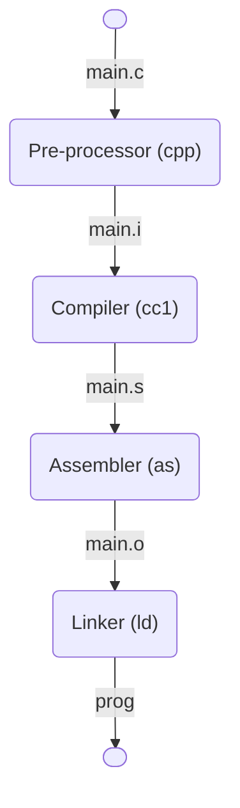

# Clang Compile Process

## C Compilation Flow Chart


## Preprocessing Command  

`cpp -o main.i main.c`

`gcc -E -o main.i main.c`

## Compiling Command

`cc -s -o main.s main.i`

`gcc -s -o main.s main.i`

## Assembling

`as -o main.o main.s`

## Linking  Command

`ld -static -o prog main.o `

## cpp C Pre-processer

## cc C Compiler

## as Assembler

## ld linker

`gcc -v main.{c,i,s,o} lib.{o,a,so}+`

`gcc -o prog main.{c,i,s,o} lib.{o,a,so}+ `

## static libraries

create static library
```shell
# example
linux> ar rcs libvector.a addvec.o multvec.o
# method
linux> ar rcs libfunc.a func.o+
```

extract static library

```bash
linux> ar x libvector.a --output ..
```

## shared libraries

create shared library
```bash
linux> gcc -shared -fpic -o addvec.so addvec.c multvec.c # fpic weizhiwuguang
```

show executable file dynamic library

- ldd exec-file
* objdump exec-file

